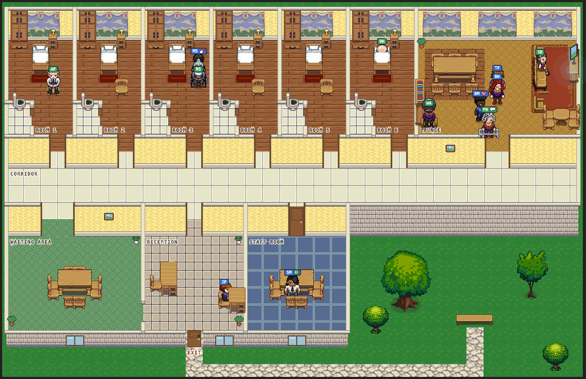
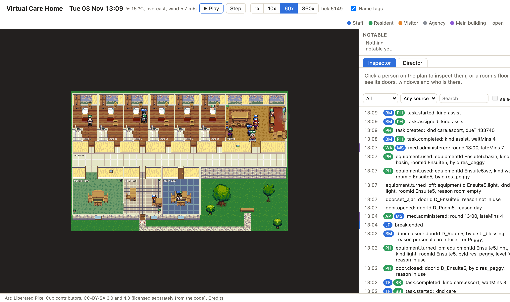
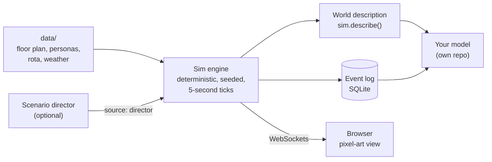

<div align="center">

# Virtual Care Home

**A simulated UK care home that produces realistic, fully labelled activity data for testing ML and AI models.**

Six residents, ten staff and twenty-five visitors live through ordinary days on one care home wing.
Every movement, task, door, window, light and kettle is logged, so you get ground truth that real care homes can't easily give you.


[](LICENSE)

**[Live demo](#)** <sub>(coming soon)</sub>



<sub>Tuesday 13:09. Lunch in the Lounge, Raj in his wheelchair in Room 3, the nurse on the 13:00 medication round.</sub>

</div>

---

## Why this exists

Care homes are a hard place to build data-driven tools for. Real data is scarce, private and almost never labelled: a sensor sees *something* moving in Room 4, but nobody wrote down that it was a carer helping Stan to the toilet at 02:14 with the en-suite door closed.

This project flips that around. It simulates the home instead, so **every reading comes with its ground truth**. You can run a year of ordinary days in minutes, re-run any of them exactly, and change one thing (a short-staffed weekend, a norovirus outbreak, a cold snap) to see what your model makes of it.

It's meant as a **test bed for models that live elsewhere**, for example:

| You're building | What the simulation gives you |
|---|---|
| **Occupancy and activity recognition** (PIR, door contacts, wearables) | Who is in which room, where, and what they're doing, every 5 seconds |
| **Indoor air, heat and energy models** | Activity with metabolic rate (MET), doors and windows open or closed, lights and heating on, and real hourly London weather |
| **Infection spread and surface contamination** | Every touch: who touched which object, when, and where |
| **Falls, wandering and anomaly detection** | Labelled events from a scenario director at realistic base rates (falls, night wandering, illness, outbreaks) |
| **Staffing and scheduling analytics** | The rota, every care task with its wait time, call bells, breaks, sick calls and agency cover |
| **Agents and LLMs in care settings** | A rich, rule-driven world to drop agents into (LLM "minds" for residents and staff are on the roadmap) |

> [!NOTE]
> Not a clinical tool. All people in the simulation (residents, staff and visitors) are fictional; any resemblance to real people is coincidental. Care routines are modelled only as far as they change **who is where, doing what, and for how long**.

## What a day looks like

The wing runs on a believable UK care home routine: night checks, morning care, breakfast in the Lounge, the medication rounds, visitors in the afternoon, TV in the evening, bedtime care and the night shift. Seeded randomness means no two days are the same, but any day can be replayed byte for byte.



The browser view is a live window onto the server's simulation: play, pause, speed up to 360×, click a person or room to inspect it, and watch the event log scroll by.

## The data

### 1. The event log

Every state change is an event with a timestamp, the people involved and a `source` (`engine`, `director`, `user`, `llm` or `external`). Server runs are written to SQLite in `runs/`; the headless CLI prints the same log:

```text
Tue 03 Nov 06:06:10  engine person.entered_room    stf_florin     roomId=Room6 fromRoomId=Corridor
Tue 03 Nov 06:06:10  engine equipment.turned_on    stf_florin     equipmentId=Room6.light kind=light level=dim reason=night check
Tue 03 Nov 06:06:20  engine resident.checked       res_dennis,stf_florin residentId=res_dennis sinceLastMins=30 via=check
Tue 03 Nov 06:09:20  engine intake.recorded        res_dennis     residentId=res_dennis fluidsMl=50
Tue 03 Nov 06:10:00  engine equipment.turned_off                  equipmentId=Room6.light kind=light reason=asleep
Tue 03 Nov 06:30:00  engine resident.woke          res_arthur     residentId=res_arthur reason=routine
```

### 2. The world description

A versioned snapshot of the whole wing at any moment (`sim.describe()`, schema 1): everyone's position and activity, every door, window and piece of equipment, recent touches and the weather.

```jsonc
{
  "schema": 1,
  "t": 200400,                       // Wed 07:40
  "people": [
    { "personId": "res_arthur", "kind": "resident", "roomId": "Room1", "x": 2.75, "y": 2.75,
      "activity": "sitting", "met": 1.3, "intensity": "sedentary", "book": "older", "code": "0702160" }
  ],
  "doors":     [{ "doorId": "D_Room5", "state": "open", "heldBy": null }],
  "windows":   [{ "windowId": "Window_Room5", "state": "closed", "openingMm": 0 }],
  "equipment": [{ "equipmentId": "Room5.radiator", "kind": "heating", "on": true, "setpointC": 21 }],
  "touches":   [{ "personId": "stf_blessing", "objectId": "D_Room4.handle", "t": 200400 }],
  "weather":   { "time": "2025-11-04T07:00", "tempC": 13.6, "humidityPct": 87, "windMps": 4.08, "isDay": true }
}
```

MET values and codes come from the 2024 Compendium of Physical Activities (the Older Adult Compendium for residents). Weather is 12 months of real hourly London data from Open-Meteo, mapped onto the sim's calendar.

> A versioned per-minute export to files, for models to read directly, is the next step for the data pipeline.

## Quick start

You need Node 22.13+ and pnpm 9.

```sh
pnpm install
pnpm dev          # sim server on :8787, browser app on http://localhost:5173
```

Open http://localhost:5173 and press **Play**.

### Headless runs

```sh
# A day of events for seed 1
pnpm --filter @vch/sim-engine sim --seed 1 --hours 24

# A week with a report (requests per day, longest waits, call-outs)
pnpm --filter @vch/sim-engine sim --seed 1 --hours 168 --report

# Four weeks of random events (falls, sick calls, outbreaks...) across eight seeds
pnpm --filter @vch/sim-engine sim --director random --hours 672 --seeds 1-8 --report

# The world description at a moment, as JSON
pnpm --filter @vch/sim-engine describe --seed 1 --at "Wed 07:40" --room Room5
```

### Scenarios

The scenario director is off by default. Turn it on for unplanned events at realistic rates, or play a scripted scenario from [`data/scenarios/`](data/scenarios/): `calm-week`, `short-staffed-weekend`, `flu-outbreak`, `norovirus-outbreak`, `birthday-party`.

```sh
DIRECTOR=random pnpm dev
SCENARIO=short-staffed-weekend pnpm dev
START=2027-05-04 pnpm dev      # start on a date, with that season's weather
```

## Hosting

The live demo runs the wing continuously at 10x for read-only viewers, with the web app on Vercel and the sim server on Fly.io. Running it yourself with `pnpm dev` gives you every control: all speeds, pause, step, the Director tab and event injection. To host your own copy, follow [`docs/13-hosting.md`](docs/13-hosting.md): about $6 a month.

## How it works



- **Deterministic.** Seeded RNG only and no wall-clock time in the engine, so a seed and a set of inputs always give the same run. Golden tests guard this.
- **Server-authoritative.** The engine is the single writer; the browser only draws what it's told.
- **Describes, doesn't simulate physics.** The engine says a window is open and five people are sitting in the Lounge; working out the CO₂ or the heat loss is the job of an external model.
- **Behaviour.** Needs and utility AI decide what people want; behaviour trees run care procedures; two-person tasks such as hoist transfers are reserved for two carers.

## The people

| | Count | Examples |
|---|---|---|
| Residents | 6 | Peggy (Alzheimer's, walks with a zimmer), Arthur (Parkinson's, time-critical meds), Raj (after a stroke, hoist and wheelchair), Stan (Lewy body dementia, wanders at night) |
| Staff | 10 | The wing manager, a nurse, senior carers, care assistants, an activities coordinator and a receptionist across day and night shifts, plus bank and agency cover |
| Visitors | 25 | Families, friends and clergy, each with their own visiting habits |

Personas live in [`data/personas/`](data/personas/), each with a care card, routines and relationships.

## Repository

| Path | What |
|---|---|
| [`packages/sim-engine`](packages/sim-engine) | The deterministic simulation (no I/O) and the headless CLI |
| [`packages/shared-types`](packages/shared-types) | Events, commands, state and the world description, shared by server and browser |
| [`apps/server`](apps/server) | Node server: hosts the engine, WebSockets, SQLite event log |
| [`apps/web`](apps/web) | React + Pixi pixel-art view and control dashboard |
| [`data/`](data) | Floor plan, personas, rota, scenarios, activities and weather |
| [`docs/`](docs) | Design docs (start with [`00-constitution.md`](docs/00-constitution.md)), ADRs and the [roadmap](docs/roadmap.md) |

```sh
pnpm typecheck    # every package
pnpm test         # Vitest across the repo
```

## Evidence and sources

The wing's rules, rates and data come from UK regulation, public health guidance and published research. Each rule's source is recorded next to its value in [`data/`](data) and in the design docs ([`docs/05`](docs/05-care-operations.md), [`docs/10`](docs/10-director-and-scenarios.md)). Where no source fits, the value is marked there as a modelling assumption.

### Regulation (England)

| Source | Used for |
|---|---|
| [Health and Social Care Act 2008 (Regulated Activities) Regulations 2014, **Regulation 18**](https://www.legislation.gov.uk/uksi/2014/2936/regulation/18) | Staffing: no fixed ratio, "sufficient numbers" of suitably skilled staff, a registered nurse on duty |
| [Regulated Activities Regulations 2014, **Regulation 9A**](https://www.legislation.gov.uk/uksi/2014/2936/regulation/9A) (in force 6 April 2024) and [CQC guidance](https://www.cqc.org.uk/guidance-regulation/providers/regulations-service-providers-and-managers/health-social-care-act/regulation-9a) | Open visiting: no set visiting hours, visits on each visitor's own pattern |
| [CQC (Registration) Regulations 2009, **Regulation 16**](https://legislation.gov.uk/uksi/2009/3112/regulation/16) and [**Regulation 18**](https://legislation.gov.uk/uksi/2009/3112/regulation/18) | CQC notifications flagged on a death, a serious injury or a hospital conveyance |
| [Working Time Regulations 1998, Regulation 10](https://www.legislation.gov.uk/uksi/1998/1833/regulation/10) | 11 hours' rest between shifts in the rota |
| HM Government, [*Fire safety risk assessment: residential care premises*](https://www.gov.uk/government/publications/fire-safety-risk-assessment-residential-care-premises) | Day-room fire doors held open on hold-open devices, closed overnight |
| HSE, [*Falls from windows or balconies in health and social care*](https://www.hse.gov.uk/healthservices/falls-windows.htm) | Window restrictors: every window opens 100 mm at most |

### Infection and outbreaks

| Source | Used for |
|---|---|
| UKHSA, [*Management of acute respiratory infection outbreaks in care homes*](https://www.gov.uk/government/publications/acute-respiratory-disease-managing-outbreaks-in-care-homes/management-of-acute-respiratory-infection-outbreaks-in-care-homes-guidance) (updated 24 July 2024) | Flu outbreaks: declared at 2 linked resident cases within 5 days, over 5 days after the last onset |
| Norovirus Working Party, [*Guidelines for the management of norovirus outbreaks in acute and community health and social care settings*](https://www.gov.uk/government/publications/norovirus-managing-outbreaks-in-acute-and-community-health-and-social-care-settings) (2012, PHE) | Norovirus outbreaks: declared at 2 linked cases, over 48 hours after the last case is well and 72 hours after the last onset |

### Base rates and clinical evidence

| Source | Used for |
|---|---|
| Gertner et al., [*Falls among residents living in care homes using real-time data collection: a large UK case-control study*](https://pmc.ncbi.nlm.nih.gov/articles/PMC13092222/), *Health Science Reports* (2026) | Falls: 1,249 per 1,000 residents a year, peaking in the morning |
| Shah et al., [*Mortality in older care home residents in England and Wales*](https://pubmed.ncbi.nlm.nih.gov/23305759/), *Age and Ageing* (2013) | Deaths: 26.2% of residents within a year |
| Health Foundation, [*Emergency admissions to hospital from care homes*](https://reader.health.org.uk/emergency-admissions-to-hospital-from-care-homes/background) (2019) | Hospital admissions: 0.70 per resident a year |
| [National Hip Fracture Database, 2024 report](https://www.nhfd.co.uk/2024report) and the [REDUCE study](https://www.thelancet.com/journals/lanhl/article/PIIS2666-7568(23)00086-7/fulltext), *Lancet Healthy Longevity* (2023) | Hospital stay after a serious fall |
| Lim et al., [*BTS adult community acquired pneumonia audit 2009/10*](https://pubmed.ncbi.nlm.nih.gov/21502103/), *Thorax* (2011) | Hospital stay for a chest infection |
| UKHSA UTI hospitalisations 2023–24, via [Care England](https://www.careengland.org.uk/care-england-briefing-to-members-on-the-ukhsa-report-understanding-the-burden-of-uti-hospitalisations-in-england/) | Hospital stay for a UTI |
| [ILC-UK, *Hydration and older people in the UK*](https://ilcuk.org.uk/wp-content/uploads/2018/10/Hydration-and-older-people-in-the-UK-2.pdf) (2018) and [*Age and Ageing* (2014)](https://academic.oup.com/ageing/article/43/suppl_1/i33/88638) | Hospital stay for dehydration |
| Barber et al., [*Care homes' use of medicines study (CHUMS)*](https://www.ncbi.nlm.nih.gov/pmc/articles/PMC2762085/), *Quality and Safety in Health Care* (2009) | Medication rounds that can be interrupted, each interruption raising the chance of a missed dose |
| Alzheimer's Society, [*Facts for the media*](https://www.alzheimers.org.uk/what-we-do/news-and-media/facts-media) | About 70% of care home residents have dementia: 4 of the 6 residents do |
| Dementia UK, [*Sundowning*](https://www.dementiauk.org/information-and-support/health-advice/sundowning/) | Sundowning from late afternoon for residents with dementia (Peggy from 16:00, Stan from 16:30) |

### Activity, workforce and weather data

| Source | Used for |
|---|---|
| Willis et al., [*2024 Older Adult Compendium of Physical Activities*](https://pacompendium.com/older-adult-compendium/), *Journal of Sport and Health Science* (2024) | MET values for residents |
| Herrmann et al., [*2024 Adult Compendium of Physical Activities*](https://pacompendium.com/adult-compendium/), *Journal of Sport and Health Science* (2024) | MET values for staff and visitors |
| Skills for Care, [*The state of the adult social care sector and workforce in England*](https://www.skillsforcare.org.uk/Adult-Social-Care-Workforce-Data/workforceintelligence/resources/Reports/National/The-state-of-the-adult-social-care-sector-and-workforce-in-England-2025-Executive-Summary.pdf) (2025) | Bank and agency cover in the staff mix |
| [Open-Meteo historical weather API](https://open-meteo.com/en/docs/historical-weather-api), from Copernicus ERA5 | 12 months of real hourly London weather |

### Also reviewed

Guidance read while checking the building, ventilation and infection rules. Not every recommendation is modelled.

- UKHSA/DHSC, [*Infection prevention and control: resource for adult social care*](https://www.gov.uk/government/publications/infection-prevention-and-control-in-adult-social-care-settings/infection-prevention-and-control-resource-for-adult-social-care)
- NHS England, [*National IPC Manual*, chapter 2: transmission based precautions](https://www.england.nhs.uk/national-infection-prevention-and-control-manual-nipcm-for-england/chapter-2-transmission-based-precautions-tbps/); NHS Scotland, [*Care Home IPC Manual*](https://nipcm.hps.scot.nhs.uk/care-home-infection-prevention-and-control-manual-ch-ipcm/)
- UKHSA, [*Ventilation to reduce the spread of respiratory infections*](https://www.gov.uk/guidance/ventilation-to-reduce-the-spread-of-respiratory-infections-including-covid-19)
- UKHSA, [*Supporting vulnerable people before and during hot weather: social care managers*](https://www.gov.uk/guidance/supporting-vulnerable-people-before-and-during-hot-weather-social-care-managers)
- [*Approved Document F: Ventilation*, Volume 2](https://www.gov.uk/government/publications/ventilation-approved-document-f) (buildings other than dwellings)
- NICE, [NG149 *Indoor air quality at home*](https://www.nice.org.uk/guidance/ng149)

## Roadmap

- [x] **Phase 1:** the wing, its people and routines, pixel-art view
- [x] **Phase 2:** scenario director (falls, sick calls, outbreaks, illness, admissions, celebrations)
- [x] **v1.0-testbed:** the world description (activity and MET, doors, windows, equipment, touches, weather)
- [ ] Activity data export to files for external models
- [ ] **Phase 3:** LLM minds for residents, staff and visitors
- [ ] **Phase 4:** branching and timeline scrubbing, richer visitors

Details in [`docs/roadmap.md`](docs/roadmap.md).

## Licence and credits

The code is released under the [MIT License](LICENSE). The art and the weather data keep their own licences, listed in [`CREDITS.md`](CREDITS.md):

- **Pixel art** by Liberated Pixel Cup contributors (CC-BY-SA 3.0 and 4.0; some parts GPL), not covered by the MIT License.
- **Weather data** by [Open-Meteo.com](https://open-meteo.com/) (CC BY 4.0), from Copernicus ERA5.
