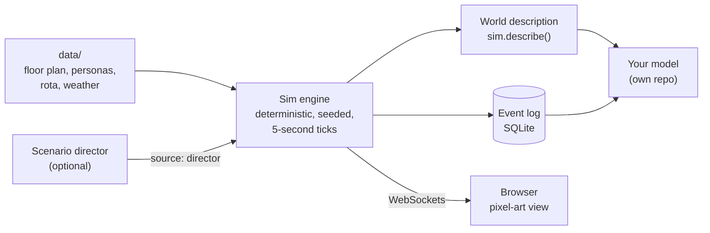

<div align="center">

# Virtual Care Home

**A simulated UK care home that produces realistic, fully labelled activity data for testing ML and AI models.**

Six residents, ten staff and twenty-five visitors live through ordinary days on one care home wing.
Every movement, task, door, window, light and kettle is logged, so you get ground truth that real care homes can't easily give you.


<sub>Tuesday 13:09. Lunch in the Lounge, Raj in his wheelchair in Room 3, the nurse on the 13:00 medication round.</sub>

</div>

---

## Why this exists

Care homes are a hard place to build data-driven tools for. Real data is scarce, private and almost never labelled: a sensor sees *something* moving in Room 4, but nobody wrote down that it was a carer helping Stan to the toilet at 02:14 with the en-suite door closed.

This project flips that around. It simulates the home instead, so **every reading comes with its ground truth**. You can run a year of ordinary days in minutes, re-run any of them exactly, and change one thing (a short-staffed weekend, a norovirus outbreak, a cold snap) to see what your model makes of it.

It's meant as a **test bed for models that live elsewhere**, for example:

| You're building | What the simulation gives you |
|---|---|
| **Occupancy and activity recognition** (PIR, door contacts, wearables) | Who is in which room, where, and what they're doing, every 5 seconds |
| **Indoor air, heat and energy models** | Activity with metabolic rate (MET), doors and windows open or closed, lights and heating on, and real hourly London weather |
| **Infection spread and surface contamination** | Every touch: who touched which object, when, and where |
| **Falls, wandering and anomaly detection** | Labelled events from a scenario director at realistic base rates (falls, night wandering, illness, outbreaks) |
| **Staffing and scheduling analytics** | The rota, every care task with its wait time, call bells, breaks, sick calls and agency cover |
| **Agents and LLMs in care settings** | A rich, rule-driven world to drop agents into (LLM "minds" for residents and staff are on the roadmap) |

> [!NOTE]
> Not a clinical tool. Every resident, staff member and visitor is synthetic. Care routines are modelled only as far as they change **who is where, doing what, and for how long**.

## What a day looks like

The wing runs on a believable UK care home routine: night checks, morning care, breakfast in the Lounge, the medication rounds, visitors in the afternoon, TV in the evening, bedtime care and the night shift. Seeded randomness means no two days are the same, but any day can be replayed byte for byte.


The browser view is a live window onto the server's simulation: play, pause, speed up to 360×, click a person or room to inspect it, and watch the event log scroll by.

## The data

### 1. The event log

Every state change is an event with a timestamp, the people involved and a `source` (`engine`, `director`, `user`, `llm` or `external`). Server runs are written to SQLite in `runs/`; the headless CLI prints the same log:

```text
Tue 03 Nov 06:06:10  engine person.entered_room    stf_florin     roomId=Room6 fromRoomId=Corridor
Tue 03 Nov 06:06:10  engine equipment.turned_on    stf_florin     equipmentId=Room6.light kind=light level=dim reason=night check
Tue 03 Nov 06:06:20  engine resident.checked       res_dennis,stf_florin residentId=res_dennis sinceLastMins=30 via=check
Tue 03 Nov 06:09:20  engine intake.recorded        res_dennis     residentId=res_dennis fluidsMl=50
Tue 03 Nov 06:10:00  engine equipment.turned_off                  equipmentId=Room6.light kind=light reason=asleep
Tue 03 Nov 06:30:00  engine resident.woke          res_arthur     residentId=res_arthur reason=routine
```

### 2. The world description

A versioned snapshot of the whole wing at any moment (`sim.describe()`, schema 1): everyone's position and activity, every door, window and piece of equipment, recent touches and the weather.

```jsonc
{
  "schema": 1,
  "t": 200400,                       // Wed 07:40
  "people": [
    { "personId": "res_arthur", "kind": "resident", "roomId": "Room1", "x": 2.75, "y": 2.75,
      "activity": "sitting", "met": 1.3, "intensity": "sedentary", "book": "older", "code": "0702160" }
  ],
  "doors":     [{ "doorId": "D_Room5", "state": "open", "heldBy": null }],
  "windows":   [{ "windowId": "Window_Room5", "state": "closed", "openingMm": 0 }],
  "equipment": [{ "equipmentId": "Room5.radiator", "kind": "heating", "on": true, "setpointC": 21 }],
  "touches":   [{ "personId": "stf_blessing", "objectId": "D_Room4.handle", "t": 200400 }],
  "weather":   { "time": "2025-11-04T07:00", "tempC": 13.6, "humidityPct": 87, "windMps": 4.08, "isDay": true }
}
```

MET values and codes come from the 2024 Compendium of Physical Activities (the Older Adult Compendium for residents). Weather is 12 months of real hourly London data from Open-Meteo, mapped onto the sim's calendar.

> A versioned per-minute export to files, for models to read directly, is the next step for the data pipeline.

## Quick start

You need Node 22.13+ and pnpm 9.

```sh
pnpm install
pnpm dev          # sim server on :8787, browser app on http://localhost:5173
```

Open http://localhost:5173 and press **Play**.

### Headless runs

```sh
# A day of events for seed 1
pnpm --filter @vch/sim-engine sim --seed 1 --hours 24

# A week with a report (requests per day, longest waits, call-outs)
pnpm --filter @vch/sim-engine sim --seed 1 --hours 168 --report

# Four weeks of random events (falls, sick calls, outbreaks...) across eight seeds
pnpm --filter @vch/sim-engine sim --director random --hours 672 --seeds 1-8 --report

# The world description at a moment, as JSON
pnpm --filter @vch/sim-engine describe --seed 1 --at "Wed 07:40" --room Room5
```

### Scenarios

The scenario director is off by default. Turn it on for unplanned events at realistic rates, or play a scripted scenario from [`data/scenarios/`](data/scenarios/): `calm-week`, `short-staffed-weekend`, `flu-outbreak`, `norovirus-outbreak`, `birthday-party`.

```sh
DIRECTOR=random pnpm dev
SCENARIO=short-staffed-weekend pnpm dev
START=2027-05-04 pnpm dev      # start on a date, with that season's weather
```

## How it works



- **Deterministic.** Seeded RNG only and no wall-clock time in the engine, so a seed and a set of inputs always give the same run. Golden tests guard this.
- **Server-authoritative.** The engine is the single writer; the browser only draws what it's told.
- **Describes, doesn't simulate physics.** The engine says a window is open and five people are sitting in the Lounge; working out the CO₂ or the heat loss is the job of an external model.
- **Behaviour.** Needs and utility AI decide what people want; behaviour trees run care procedures; two-person tasks such as hoist transfers are reserved for two carers.

## The people

| | Count | Examples |
|---|---|---|
| Residents | 6 | Peggy (Alzheimer's, walks with a zimmer), Arthur (Parkinson's, time-critical meds), Raj (after a stroke, hoist and wheelchair), Stan (Lewy body dementia, wanders at night) |
| Staff | 10 | The wing manager, a nurse, senior carers, care assistants, an activities coordinator and a receptionist across day and night shifts, plus bank and agency cover |
| Visitors | 25 | Families, friends and clergy, each with their own visiting habits |

Personas live in [`data/personas/`](data/personas/), each with a care card, routines and relationships.

## Repository

| Path | What |
|---|---|
| [`packages/sim-engine`](packages/sim-engine) | The deterministic simulation (no I/O) and the headless CLI |
| [`packages/shared-types`](packages/shared-types) | Events, commands, state and the world description, shared by server and browser |
| [`apps/server`](apps/server) | Node server: hosts the engine, WebSockets, SQLite event log |
| [`apps/web`](apps/web) | React + Pixi pixel-art view and control dashboard |
| [`data/`](data) | Floor plan, personas, rota, scenarios, activities and weather |
| [`docs/`](docs) | Design docs (start with [`00-constitution.md`](docs/00-constitution.md)), ADRs and the [roadmap](docs/roadmap.md) |

```sh
pnpm typecheck    # every package
pnpm test         # Vitest across the repo
```

## Roadmap

- [x] **Phase 1:** the wing, its people and routines, pixel-art view
- [x] **Phase 2:** scenario director (falls, sick calls, outbreaks, illness, admissions, celebrations)
- [x] **v1.0-testbed:** the world description (activity and MET, doors, windows, equipment, touches, weather)
- [ ] Activity data export to files for external models
- [ ] **Phase 3:** LLM minds for residents, staff and visitors
- [ ] **Phase 4:** branching and timeline scrubbing, richer visitors

Details in [`docs/roadmap.md`](docs/roadmap.md).

## Credits

Pixel art by Liberated Pixel Cup contributors (CC-BY-SA 3.0 and 4.0, licensed separately from the code). Weather data by [Open-Meteo.com](https://open-meteo.com/) (CC BY 4.0), from Copernicus ERA5. Full credits in [`CREDITS.md`](CREDITS.md).
